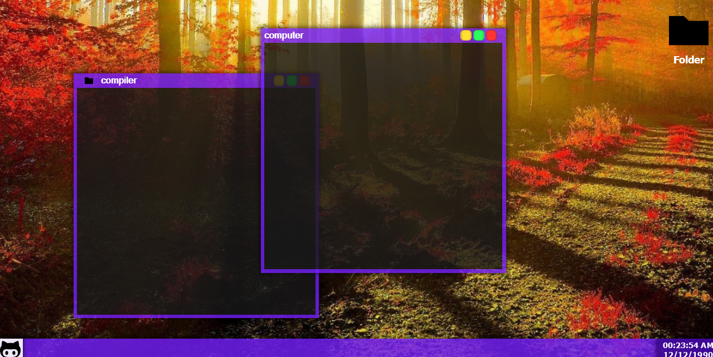
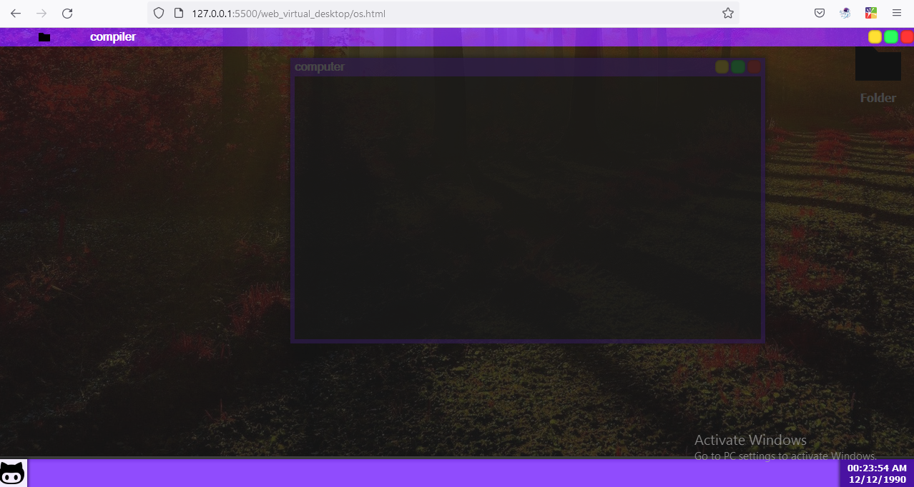

<h1> DesktopJS </h1>


<br>
<h1> About </h1>

DesktopJS it's a javascript library for building virtual desktop environment as a web-app .

<br>
<h1> Preview </h1>



<br>
<h1> Get Started </h1>

if you want to use it directly , just include "min-version" .

```js
    // "min-version" not available yet :(
```

if you want to use "dev-version" , follow instructions below .

1 - clone this repo

```
git clone https://github.com/Mouradouchane/DesktopJS.git
```

2 - import "dev-version" to your project 

```js
import { desktop } from "...path/Desktop-dev/desktop.js";
``` 

3 - start usage and take a look to the <a href="../../wiki">docs </a> .

<br>
<h1> Snippet </h1>

simple example of desktop and window with resize and drag events .

```js

// desktop object
const desk = new desktop( document.body );

// new window
let window = desktop.new.window( ...pass_args );

// make window open or visible
window.open();

// resize event only if window get resized in left
window.on.resize.left( function( WIN , EVENT ) {

    console.warn( "Hi , resize in left is happening !");
    // log current window widht and height
    console.log("Width  :" , window.get.width()  );
    console.log("Height :" , window.get.height() );
});

// when window in drag in event
window.on.drag( function( WIN , EVENT ) {

    console.warn( "Hi , window in drag right now");
    // log current window x and y position
    console.log("X :" , window.get.x());
    console.log("y :" , window.get.y());
});
``` 
<br>
<h1> Documentation </h1>

under construction right now but you can using it to get details about everything in the library <a href="../../wiki"> docs</a> .

<br>
<h1> Contributions </h1>

- if you found any kind of "bug , error , problems" feel free to open <a herf="../../issues"> issues </a> and talk about what you found .

- if you want to contribute here in DesktopJS you welcome , you can "fix bugs" , "add futures" , "improve codes" , "refactor codes" DesktopJS is open for you and everyone else .

- just before you start working on anything directly , talk to me about it then feel free to do what you want 😃 .

